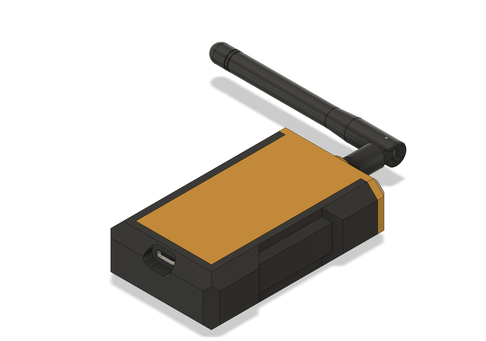

# BitRelay ESP32

A BLE mesh relay node for [bitchat](https://bitchat.free/), built with MicroPython on ESP32.



BitRelay extends the range of the bitchat mesh network by acting as a relay between phones that can't directly reach each other over Bluetooth.

This is a proof of concept submitted to the Engineering Design Competition by UBC Sailbot, where it won the **Best Social Impact Award**.

## How it works

The ESP32 runs as both a BLE peripheral (accepts connections) and a BLE central (connects to peers) simultaneously using the same GATT service UUID as the bitchat apps. When it receives a packet from one peer, it decrements the TTL and rebroadcasts to all other connected peers.

## Features

- Protocol-compatible with bitchat Android and iOS
- Transparent relay — forwards packets with original signatures preserved
- Packet deduplication, fragment reassembly, and TTL management
- NTP time sync at boot for valid timestamps
- Full bitchat client — send and receive messages, change nickname via serial REPL

## Note on timekeeping

The device requires WiFi at boot to sync time via NTP — the bitchat protocol rejects packets with timestamps older than 3 minutes. WiFi is disabled immediately after sync. This means the device needs to be near a known WiFi network on each power-up.

An RTC module (e.g. DS3231) could eliminate this requirement by keeping time via a battery-backed clock, allowing the device to operate in locations with no WiFi access at all.

## Limitations

- **Requires PSRAM** — the pure-Python Ed25519 and SHA-512 implementations are memory-hungry. Without PSRAM you will likely hit OOM errors. Use an ESP32 or ESP32-S3 board with PSRAM.
- Tested on ESP32 and ESP32-S3 with MicroPython firmware v1.27.0.

## Setup

```bash
# Install aioble (one-time)
mpremote mip install aioble

# Configure WiFi credentials for NTP
cp config_local.py.example config_local.py
# Edit config_local.py and set WIFI_SSID and WIFI_PASSWORD

# Deploy to ESP32
mpremote connect /dev/ttyUSB0 cp config.py config_local.py identity.py protocol.py ble_mesh.py relay.py terminal.py main.py ed25519.py sha512.py :

# Run
mpremote connect /dev/ttyUSB0 run main.py
```

Alternatively, you can use the [MicroPico](https://marketplace.visualstudio.com/items?itemName=paulober.pico-w-go) VS Code extension to upload the project and run `main.py`.

